# Reusable Launch Vehicle — Full Mission Simulation

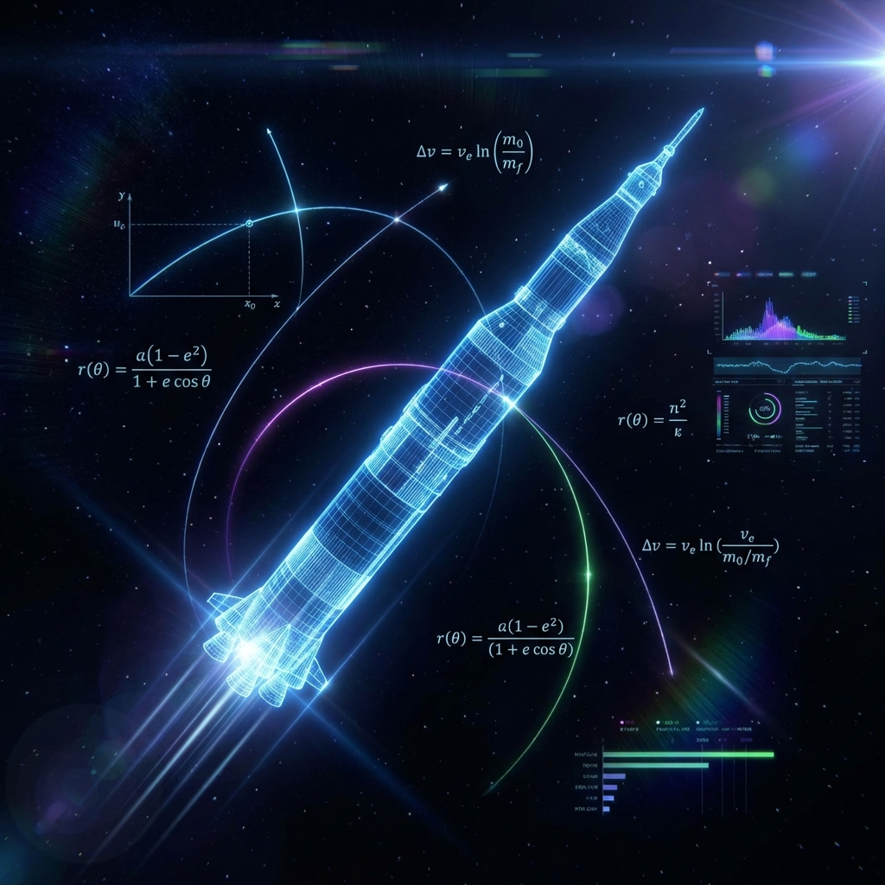

[](https://github.com/HemanthBear99/Rocket/actions/workflows/ci.yml)
[](https://www.python.org/)
[](docs/RLV_Developer_3.txt)
[](tests/)
[](plots/)

> **A physics-based 6-DOF simulation of a two-stage reusable launch vehicle: from liftoff to orbit insertion and booster return-to-launch-site landing.**

---

## What This Project Does

This simulation models the **complete mission profile** of a two-stage reusable launch vehicle, end to end:

```
LIFTOFF ──► GRAVITY TURN ──► MECO ──► STAGE SEPARATION
                                            │
                        ┌───────────────────┴───────────────────┐
                        ▼                                       ▼
                   STAGE 2 (Orbiter)                     STAGE 1 (Booster)
                   Orbit Insertion                       Boostback Burn
                   Coast to Apogee                       Ballistic Coast
                   Circularization                       Entry Burn
                        │                                Suicide Burn Landing
                        ▼                                       ▼
                   400 km LEO                            RTLS TOUCHDOWN
```

Every force, torque, and trajectory is computed from **first-principles physics** — no precomputed tables, no trajectory playback, no shortcuts.

---

## Mission Results

The simulation completes a full mission in ~100 seconds of wall time, producing the following verified results:

### Stage 1 Ascent (Stacked S1 + S2)

| Parameter | Value | Notes |
|:---|:---|:---|
| **Liftoff Mass** | 540,000 kg | S1 (420t) + S2 (120t) |
| **MECO Pitch** | 50.4° from vertical | Target: 45°-60° |
| **Separation Altitude** | 68.4 km | At t = 131 s |
| **Separation Velocity** | 2,277 m/s | Inertial, hypersonic (Mach 6.5) |
| **Max-Q** | ~38 kPa | At ~60 s (structural limit: 35 kPa) |

### Stage 2 — Orbit Insertion

| Parameter | Value | Notes |
|:---|:---|:---|
| **Target Orbit** | 400 km LEO | Circular |
| **Achieved Orbit** | 397.5 km | Perigee 375 km, Apogee 402 km |
| **Orbital Velocity** | 7,669 m/s | Near v_circular = 7,672 m/s |
| **Eccentricity** | 0.002 | Near-circular (target: e < 0.01) |
| **Insertion Method** | Two-phase | Apogee raise + circularize at apogee |

### Stage 1 — Booster RTLS Landing

| Parameter | Value | Notes |
|:---|:---|:---|
| **Touchdown Speed** | 1.78 m/s | Air-relative (target: < 5 m/s) |
| **Landing Site Error** | 23 km | From launch pad |
| **Peak Booster Altitude** | 144 km | Post-separation ballistic arc |
| **Fuel Budget** | 45,000 kg total | BB: 29.9k + Entry: 6.0k + Landing: 2.2k |
| **Landing Method** | Energy-based suicide burn | Tsiolkovsky variable-mass ignition timing |

---

## Ascent Plots

> Plots are **auto-regenerated** by CI on every push to `main`, so the images below always reflect the latest simulation code.

### Ascent Profile Dashboard
*Altitude, velocity, mass, pitch, flight path angle, and ground track in a single view.*

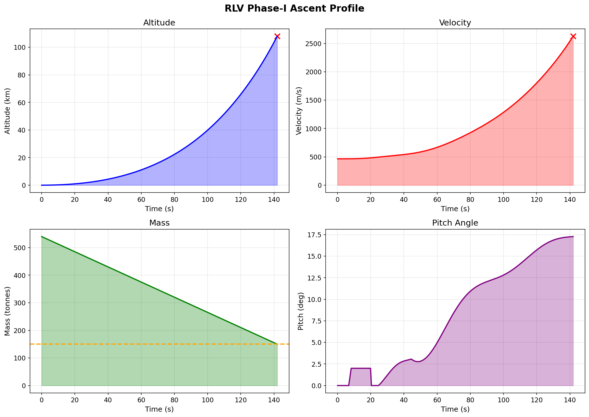

### Control System Performance
*Attitude tracking error, control torque magnitude, and guidance commands during ascent.*

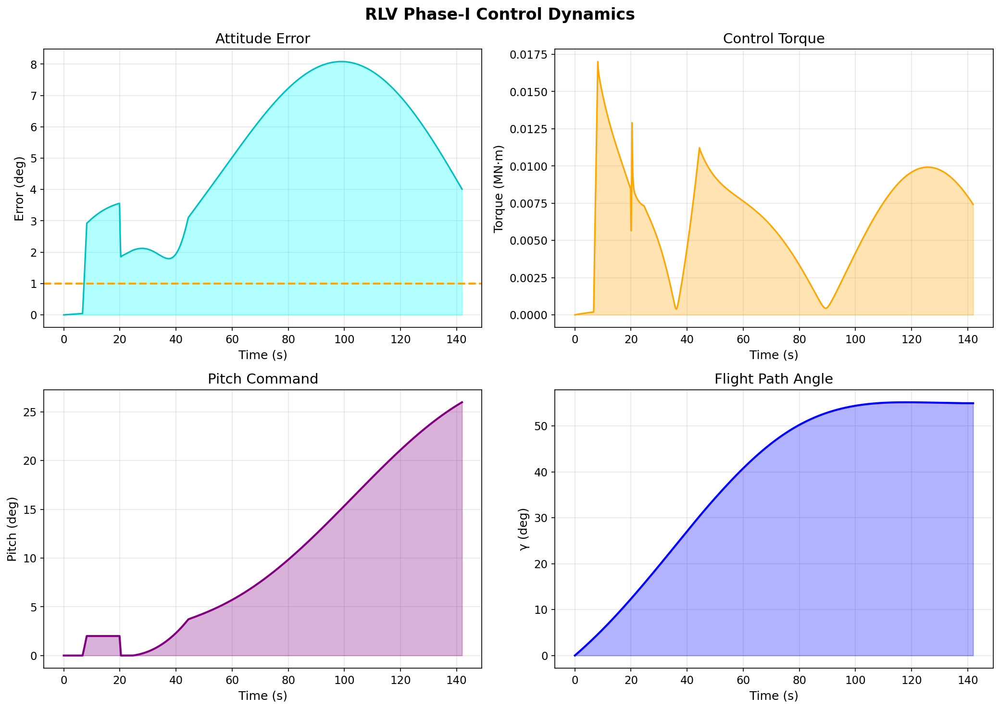

### Physics Validation
*Pitch angle vs wind-relative velocity vector and angle of attack vs dynamic pressure.*

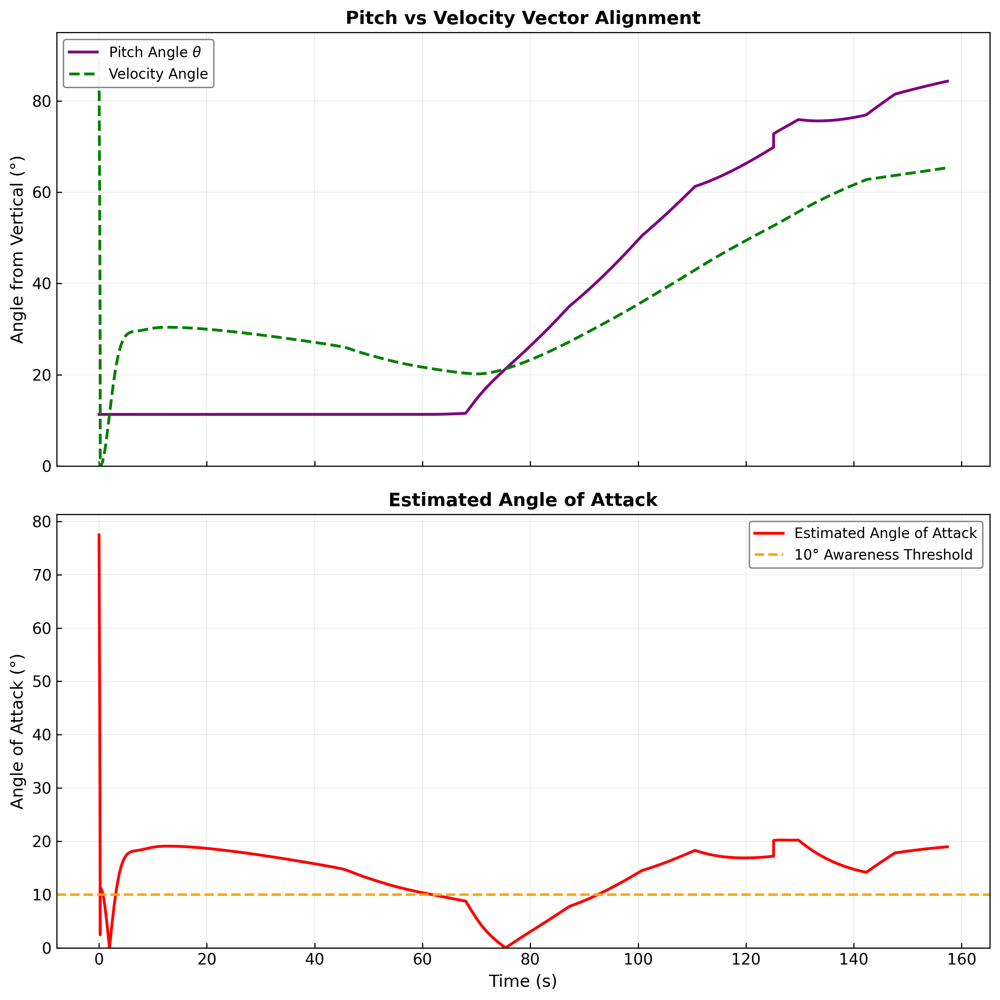

### Flight Path Angle
*Flight path angle starts at 90° (vertical) and decreases through the gravity turn — matching real rocket trajectories.*

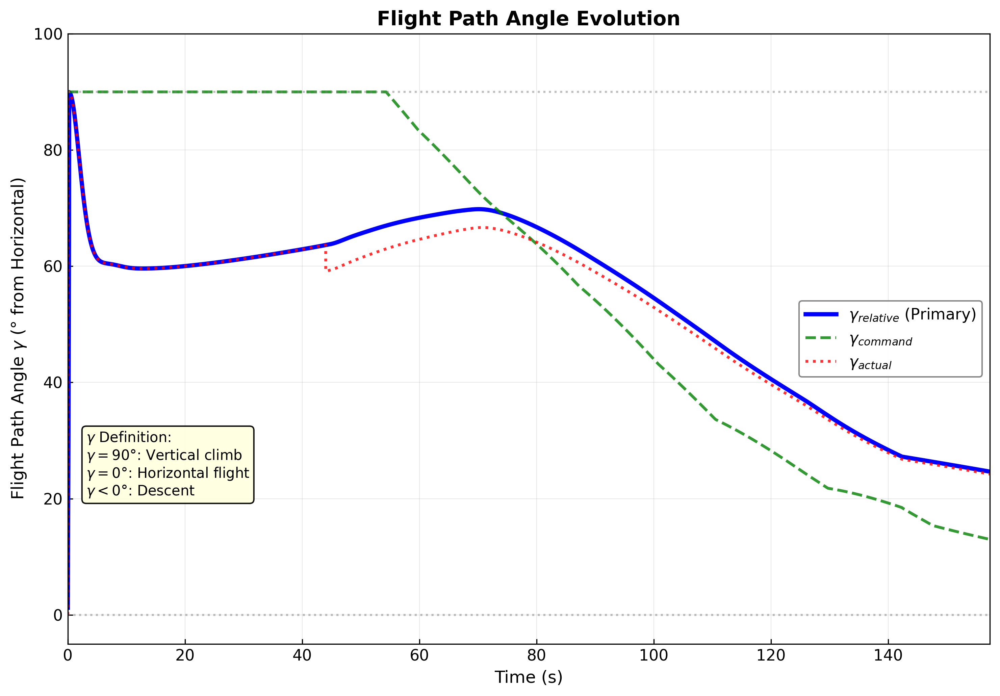

---

## Full Mission Plots

### Mission Altitude Timeline
*All three vehicles tracked simultaneously: stacked ascent (blue), orbiter coasting to 400 km (green), booster RTLS arc (red).*

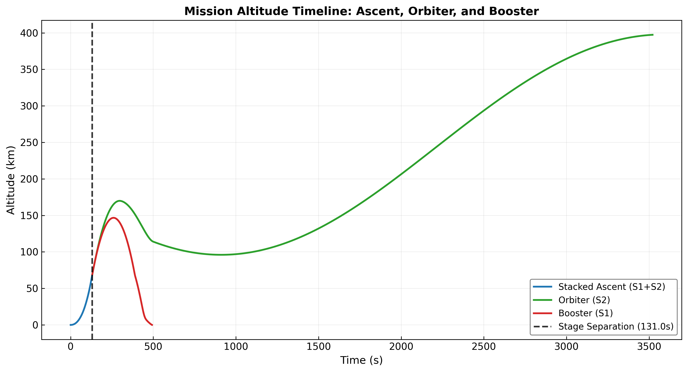

### Mission Velocity Timeline
*Orbiter accelerates to orbital velocity (~7,700 m/s) while the booster decelerates to landing.*

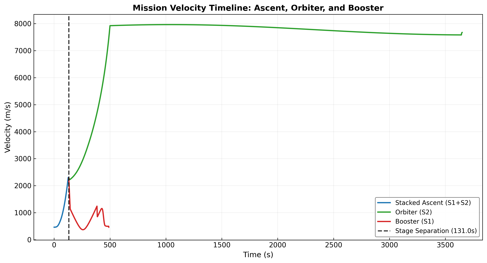

---

## Booster Recovery Plots

### Booster Altitude Profile
*Post-separation ballistic arc to 144 km apogee, then descent and landing.*

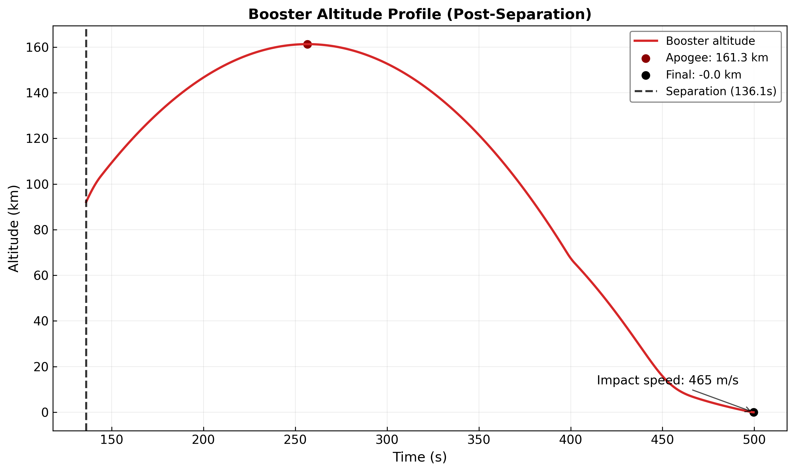

### Booster Landing Zoom
*Final 140 seconds — altitude and speed converge to zero at touchdown.*

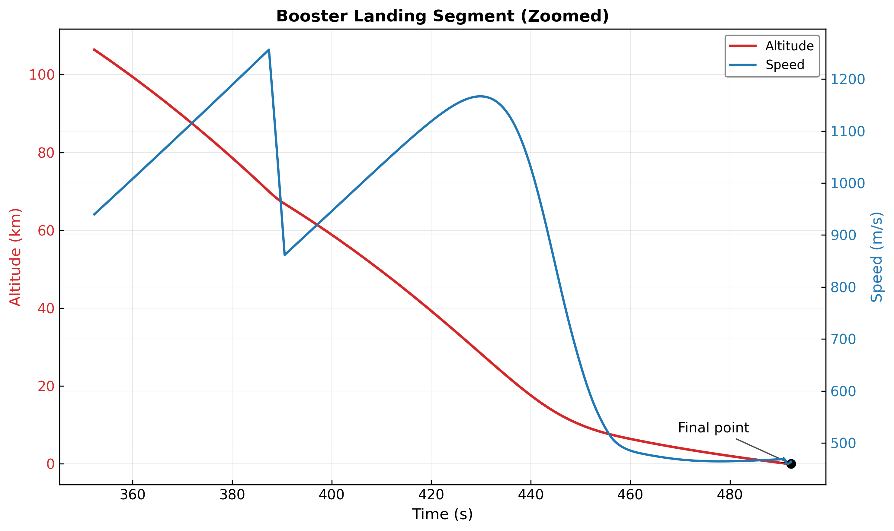

### Booster Fuel Budget
*Propellant consumption by recovery phase: boostback dominates at ~30,000 kg.*

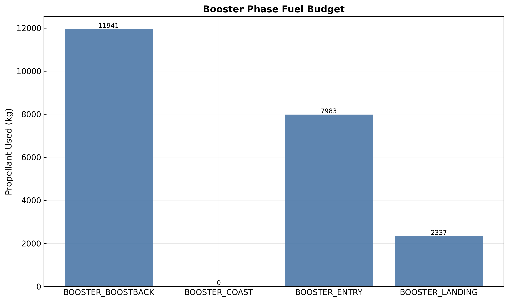

### Landing Ignition Prediction
*Energy-based suicide burn timing: predicted ignition altitude vs actual altitude.*

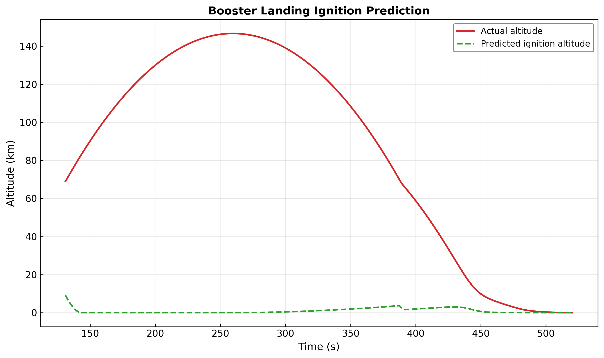

---

## Physics Engine

This simulation solves the real equations of aerospace engineering. No simplifications are hidden.

### Translational Dynamics (Newton's 2nd Law)
$$\ddot{\mathbf{r}} = \frac{1}{m}\left(\mathbf{F}_{\text{grav}} + \mathbf{F}_{\text{thrust}} + \mathbf{F}_{\text{drag}} + \mathbf{F}_{\text{lift}}\right)$$

### Rotational Dynamics (Euler's Equation)
$$\dot{\boldsymbol{\omega}} = \mathbf{I}^{-1}\left(\boldsymbol{\tau} - \boldsymbol{\omega} \times \mathbf{I}\boldsymbol{\omega}\right)$$

### Quaternion Kinematics (Singularity-Free Attitude)
$$\dot{\mathbf{q}} = \tfrac{1}{2}\,\boldsymbol{\Omega}(\boldsymbol{\omega})\,\mathbf{q}$$

### Tsiolkovsky Rocket Equation (Variable-Mass Propulsion)
$$\Delta v = v_e \ln\!\left(\frac{m_0}{m_f}\right)$$

### Force Models

| Force | Implementation | Reference |
|:---|:---|:---|
| **Gravity** | Central field + J2 oblateness perturbation | Vallado, "Fundamentals of Astrodynamics" |
| **Thrust** | Altitude-compensated: $T = T_{\text{vac}} - (T_{\text{vac}} - T_{\text{sl}})\cdot P_{\text{amb}}/P_0$ | Rocket Propulsion Elements (Sutton) |
| **Drag** | $F_d = \tfrac{1}{2}\rho\, C_d(M)\, A\, \|v_{\text{rel}}\|^2$ with Mach-dependent $C_d$ table | Standard aerodynamic model |
| **Lift** | Slender-body: $L = q_{\text{dyn}}\cdot C_{L_\alpha}\cdot\alpha\cdot A$ | Nielsen, "Missile Aerodynamics" |
| **Aero Moment** | $\mathbf{M} = \mathbf{r}_{\text{CP-CG}} \times \mathbf{F}_{\text{normal}}$ (CP-CG instability) | Atmospheric flight dynamics |
| **Atmosphere** | US Standard Atmosphere 1976, all 7 layers (0-84.852 km) | NOAA/NASA/USAF standard |

### Control System

| Component | Details |
|:---|:---|
| **Attitude Control** | Quaternion PD: $\boldsymbol{\tau} = K_p\,\mathbf{q}_{ev} - K_d\,\boldsymbol{\omega}$ |
| **Gain Scheduling** | Inertia-proportional scaling (constant bandwidth across mass range) |
| **Design Point** | $\omega_n = 1.06$ rad/s, $\zeta = 0.7$ (critically damped at launch) |
| **Torque Limit** | 30 MN-m (engine gimbal authority) |
| **Engine Transients** | Spool-up 1.5s, spool-down 0.8s rate limiting |

### Numerical Integration

| Property | Value |
|:---|:---|
| **Method** | 4th-order Runge-Kutta (RK4) |
| **Timestep** | 0.005 s (configurable) |
| **Accuracy** | O(dt^4) local truncation error |
| **Quaternion Integrity** | Re-normalized at every RK4 sub-step |
| **Mass Floor** | Enforced at dry mass to prevent negative propellant |

---

## Project Structure

```
Rocket/
├── rlv_sim/                    # Core simulation package
│   ├── main.py                 # Simulation loop & full mission orchestrator
│   ├── dynamics.py             # 6-DOF equations of motion
│   ├── forces.py               # Gravity, thrust, drag, lift, aero moments
│   ├── guidance.py             # Gravity turn, orbit insertion, booster recovery
│   ├── control.py              # Quaternion PD attitude control
│   ├── integrators.py          # RK4 & Euler numerical solvers
│   ├── frames.py               # Quaternion algebra & frame transformations
│   ├── mass.py                 # Variable mass, inertia, CG computation
│   ├── recovery.py             # Suicide burn estimation, landing site targeting
│   ├── mission_manager.py      # Phase state machine & mission sequencing
│   ├── config.py               # SimulationConfig dataclass
│   ├── constants.py            # Physical constants & vehicle parameters
│   ├── plotting.py             # 65 publication-quality plot generators
│   ├── cli.py                  # Command-line interface
│   ├── state.py                # State vector container
│   ├── validation.py           # Physics validation checks
│   ├── utils.py                # Air-relative velocity, wind model
│   ├── earth.py                # Earth models (WGS-84 toggle)
│   ├── sensors.py              # Sensor models (extensible)
│   ├── actuator.py             # Actuator models (extensible)
│   ├── flex.py                 # Flex body dynamics (extensible)
│   ├── slosh.py                # Propellant slosh model (extensible)
│   ├── thermal.py              # Thermal model (extensible)
│   ├── rcs.py                  # Reaction control system (extensible)
│   ├── montecarlo.py           # Monte Carlo dispersion analysis
│   └── abort.py                # Abort logic (extensible)
│
├── tests/                      # 262 unit & integration tests
├── plots/                      # Auto-generated simulation plots (65 PNGs)
├── docs/                       # Technical documentation
├── run_demo.py                 # Quick full-mission demo script
├── pyproject.toml              # Project config & dependencies
└── .github/workflows/ci.yml   # CI: test on Python 3.9-3.12 + auto-regenerate plots
```

---

## Getting Started

### Prerequisites

- Python 3.9 or higher
- pip

### Installation

```bash
# Clone the repository
git clone https://github.com/HemanthBear99/Rocket.git
cd Rocket

# Install the package (editable mode)
pip install -e .

# Or with development dependencies (for running tests)
pip install -e .[dev]
```

---

## How to Run

### 1. Full Mission with Plots (Recommended)

Run the complete mission (ascent + orbit insertion + booster RTLS) and generate all 65 plots:

```bash
python -m rlv_sim.plotting
```

This will:
- Run the full mission simulation (~100s wall time)
- Generate 65 publication-quality PNG plots at 300 DPI in `plots/`
- Print a mission summary to the console

### 2. Quick Demo (Console Output Only)

```bash
python run_demo.py
```

Shows detailed phase-by-phase telemetry for both orbiter and booster with no plot generation.

### 3. CLI — Ascent Only with Plots

```bash
rlv-simulate
```

Runs Stage 1 ascent simulation and generates ascent plots in `plots/`.

### 4. CLI — Ascent Only, No Plots

```bash
rlv-simulate --no-plots
```

Runs ascent simulation with console output only. Fast mode for parameter sweeps.

### 5. CLI — Quiet Mode

```bash
rlv-simulate --quiet
```

Suppress verbose output. Useful for scripting and batch runs.

### 6. CLI — Custom Output Directory

```bash
rlv-simulate -o my_results/
```

Save plots to a custom directory instead of the default `plots/`.

---

## Exporting Data

### Export Full Mission Telemetry to CSV

```python
from rlv_sim.main import run_full_mission

mission = run_full_mission(dt=0.05, verbose=False)

# Export ascent telemetry
mission.ascent_log.to_csv("ascent_telemetry.csv")

# Export orbiter telemetry
mission.orbiter_log.to_csv("orbiter_telemetry.csv")

# Export booster telemetry
mission.booster_log.to_csv("booster_telemetry.csv")

print("Telemetry exported!")
```

### One-Liner CSV Export (Command Line)

```bash
# Ascent only
python -c "
from rlv_sim.main import run_simulation
s, log, r = run_simulation(verbose=False)
log.to_csv('plots/ascent_telemetry.csv')
print(f'Saved {len(log.time)} rows to ascent_telemetry.csv')
"
```

```bash
# Full mission (all three vehicles)
python -c "
from rlv_sim.main import run_full_mission
m = run_full_mission(dt=0.05, verbose=False)
m.ascent_log.to_csv('plots/ascent_telemetry.csv')
m.orbiter_log.to_csv('plots/orbiter_telemetry.csv')
m.booster_log.to_csv('plots/booster_telemetry.csv')
print(f'Ascent: {len(m.ascent_log.time)} rows')
print(f'Orbiter: {len(m.orbiter_log.time)} rows')
print(f'Booster: {len(m.booster_log.time)} rows')
print('All telemetry saved!')
"
```

### Custom Simulation from Python

```python
from rlv_sim.main import run_full_mission
from rlv_sim.plotting import generate_all_plots, generate_mission_segment_plots

# Run with custom timestep
mission = run_full_mission(dt=0.01, verbose=True)

# Check results
print(f"Orbiter:  {mission.orbiter_reason}")
print(f"Booster:  {mission.booster_reason}")
print(f"Orbit altitude: {mission.orbiter_final_state.altitude/1000:.1f} km")

# Generate all plots
plots = generate_all_plots(mission.ascent_log, "my_plots")
plots += generate_mission_segment_plots(
    mission.ascent_log, mission.orbiter_log, mission.booster_log,
    mission.separation_time, "my_plots"
)
print(f"Generated {len(plots)} plots")
```

---

## Running Tests

```bash
# Run all 262 tests
python -m pytest

# Run with verbose output
python -m pytest -v

# Run a specific test file
python -m pytest tests/test_forces.py

# Run with coverage report
python -m pytest --cov=rlv_sim --cov-report=term-missing

# Skip slow tests
python -m pytest -m "not slow"
```

---

## Complete Plot Catalog (65 Plots)

<details>
<summary><b>Click to expand full list</b></summary>

### Ascent Trajectory (Plots 01-14)
| # | File | Description |
|---|------|-------------|
| 01 | `01_altitude_profile.png` | Altitude vs time with MECO marker |
| 02 | `02_velocity_profile.png` | Inertial vs air-relative velocity |
| 03 | `03_mass_profile.png` | Vehicle mass depletion curve |
| 04 | `04_pitch_angle.png` | Pitch angle evolution through gravity turn |
| 05 | `05_attitude_error.png` | Attitude tracking error |
| 06 | `06_control_torque.png` | Control torque magnitude |
| 07 | `07_trajectory_local.png` | 2D trajectory (altitude vs downrange) |
| 08 | `08_trajectory_3d.png` | 3D trajectory visualization |
| 09 | `09_thrust_vs_gravity.png` | Thrust force vs weight force |
| 10 | `11_dynamic_pressure.png` | Dynamic pressure (Max-Q) |
| 11 | `11_flight_path_angle.png` | Flight path angle vs time |
| 12 | `12_physics_validation.png` | AoA and pitch vs velocity validation |
| 13 | `13_comprehensive_summary.png` | 6-panel ascent dashboard |
| 14 | `14_pitch_gamma_diagnostic.png` | Pitch/gamma guidance diagnostic |

### Dashboards
| # | File | Description |
|---|------|-------------|
| 15 | `ascent_profile.png` | Ascent overview dashboard |
| 16 | `control_dynamics.png` | Control system dashboard |

### Attitude & Angular Velocity (Plots 18-21)
| # | File | Description |
|---|------|-------------|
| 17 | `18_quaternion_norm.png` | Quaternion unit-norm preservation |
| 18 | `19_omega_x_roll.png` | Roll rate history |
| 19 | `20_omega_y_pitch.png` | Pitch rate history |
| 20 | `21_omega_z_yaw.png` | Yaw rate history |

### Performance (Plots 22-27)
| # | File | Description |
|---|------|-------------|
| 21 | `22_acceleration_profile.png` | Acceleration magnitude vs time |
| 22 | `23_thrust_to_weight.png` | Thrust-to-weight ratio (TWR) |
| 23 | `24_specific_orbital_energy.png` | Specific orbital energy |
| 24 | `25_velocity_eci_x.png` | ECI velocity X component |
| 25 | `26_velocity_eci_y.png` | ECI velocity Y component |
| 26 | `27_velocity_eci_z.png` | ECI velocity Z component |

### Velocity Analysis (Plots 28-29)
| # | File | Description |
|---|------|-------------|
| 27 | `28_horiz_vs_vert_velocity.png` | Horizontal vs vertical velocity split |
| 28 | `29_mach_number.png` | Mach number with regime shading |

### Atmosphere (Plots 30-33)
| # | File | Description |
|---|------|-------------|
| 29 | `30_atm_temperature.png` | US-76 temperature profile |
| 30 | `31_atm_density.png` | Atmospheric density profile |
| 31 | `32_atm_pressure.png` | Atmospheric pressure profile |
| 32 | `33_speed_of_sound.png` | Speed of sound vs altitude |

### Propulsion (Plots 34-35)
| # | File | Description |
|---|------|-------------|
| 33 | `34_throttle_history.png` | Engine throttle setting |
| 34 | `35_inertia_variation.png` | Vehicle inertia tensor evolution |

### Quaternion Tracking (Plots 36-39)
| # | File | Description |
|---|------|-------------|
| 35 | `36_quat_w_cmd_vs_actual.png` | Quaternion W: commanded vs actual |
| 36 | `37_quat_x_cmd_vs_actual.png` | Quaternion X: commanded vs actual |
| 37 | `38_quat_y_cmd_vs_actual.png` | Quaternion Y: commanded vs actual |
| 38 | `39_quat_z_cmd_vs_actual.png` | Quaternion Z: commanded vs actual |

### Navigation & Propellant (Plots 40-43)
| # | File | Description |
|---|------|-------------|
| 39 | `40_downrange_distance.png` | Downrange distance traveled |
| 40 | `41_mass_flow_rate.png` | Propellant mass flow rate |
| 41 | `42_propellant_fraction.png` | Propellant fraction remaining |
| 42 | `43_drag_coeff_vs_mach.png` | Cd vs Mach lookup curve |

### Energy & Losses (Plots 44-48)
| # | File | Description |
|---|------|-------------|
| 43 | `44_energy_budget.png` | KE + PE + total mechanical energy |
| 44 | `45_altitude_vs_velocity.png` | Altitude-velocity phase plot |
| 45 | `46_gravity_loss.png` | Cumulative gravity loss |
| 46 | `47_drag_loss.png` | Cumulative drag loss |
| 47 | `48_delta_v_budget.png` | Ideal Tsiolkovsky vs achieved Delta-V |

### Position & Orbital (Plots 49-58)
| # | File | Description |
|---|------|-------------|
| 48 | `49_position_eci_x.png` | ECI position X |
| 49 | `50_position_eci_y.png` | ECI position Y |
| 50 | `51_position_eci_z.png` | ECI position Z |
| 51 | `52_control_bandwidth.png` | Natural frequency & bandwidth |
| 52 | `53_geocentric_radius.png` | Geocentric radius from Earth center |
| 53 | `54_angular_momentum.png` | Specific angular momentum |
| 54 | `55_q_vs_altitude.png` | Dynamic pressure vs altitude |
| 55 | `56_effective_isp.png` | Effective specific impulse |
| 56 | `57_altitude_rate.png` | Rate of altitude change |
| 57 | `58_ground_track.png` | Ground track over Earth |

### Full Mission (Plots 59-60)
| # | File | Description |
|---|------|-------------|
| 58 | `59_mission_altitude_split.png` | Ascent / Orbiter / Booster altitude timeline |
| 59 | `60_mission_velocity_split.png` | Ascent / Orbiter / Booster velocity timeline |

### Booster Recovery (Plots 61-66)
| # | File | Description |
|---|------|-------------|
| 60 | `61_booster_altitude_profile.png` | Booster post-separation altitude |
| 61 | `62_booster_velocity_profile.png` | Booster post-separation velocity |
| 62 | `63_booster_landing_zoom.png` | Final 140s landing sequence |
| 63 | `64_booster_velocity_components.png` | Booster velocity vector decomposition |
| 64 | `65_booster_ignition_prediction.png` | Suicide burn ignition timing |
| 65 | `66_booster_phase_fuel_budget.png` | Fuel consumption by recovery phase |

</details>

---

## Vehicle Parameters

| Parameter | Stage 1 | Stage 2 |
|:---|:---|:---|
| **Dry Mass** | 30,000 kg | 8,000 kg |
| **Propellant** | 390,000 kg | 112,000 kg |
| **Wet Mass** | 420,000 kg | 120,000 kg |
| **Thrust** | 7.6 MN (sea level) | 950 kN (vacuum) |
| **Isp** | 282 s (SL) / 311 s (vac) | 348 s (vacuum) |
| **Burn Time** | ~131 s | ~359 s |
| **Recovery Fuel** | 45,000 kg (11.5% of prop) | N/A |

---

## Configuration

Key simulation parameters can be adjusted in `rlv_sim/constants.py` and `rlv_sim/config.py`:

| Parameter | Default | Description |
|:---|:---|:---|
| `DT` | 0.005 s | Integration timestep |
| `MAX_TIME` | 4000 s | Maximum simulation duration |
| `TARGET_ORBIT_ALTITUDE` | 400 km | Target circular orbit |
| `STAGE1_LANDING_FUEL_RESERVE` | 45,000 kg | Fuel reserved for booster RTLS |
| `booster_boostback_budget_kg` | 30,000 kg | Boostback burn budget |
| `booster_entry_budget_kg` | 6,000 kg | Entry burn budget |
| `booster_landing_reserve_kg` | 9,000 kg | Landing burn reserve |

---

## Continuous Integration

The CI pipeline runs on every push and pull request:

1. **Test Matrix:** Python 3.9, 3.10, 3.11, 3.12 on Ubuntu
2. **262 Tests:** Unit tests, integration tests, physics validation, regression checks
3. **Auto-Plot Regeneration:** On push to `main`, the full mission simulation runs and commits updated plots automatically

---

## License

MIT

---

<p align="center">
  <i>Built from first principles. Every force computed. Every trajectory earned.</i>
</p>
