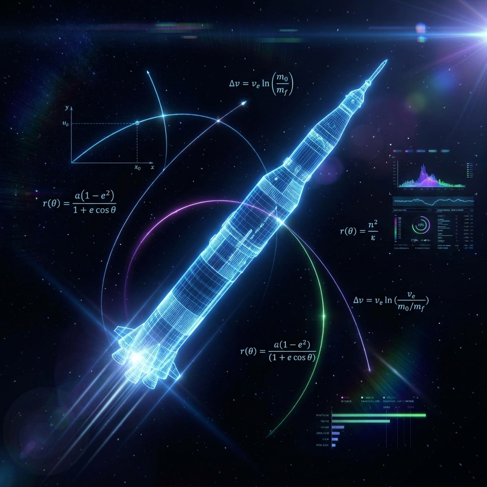
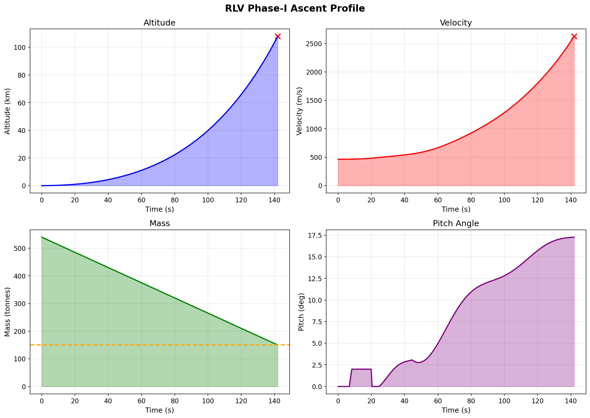
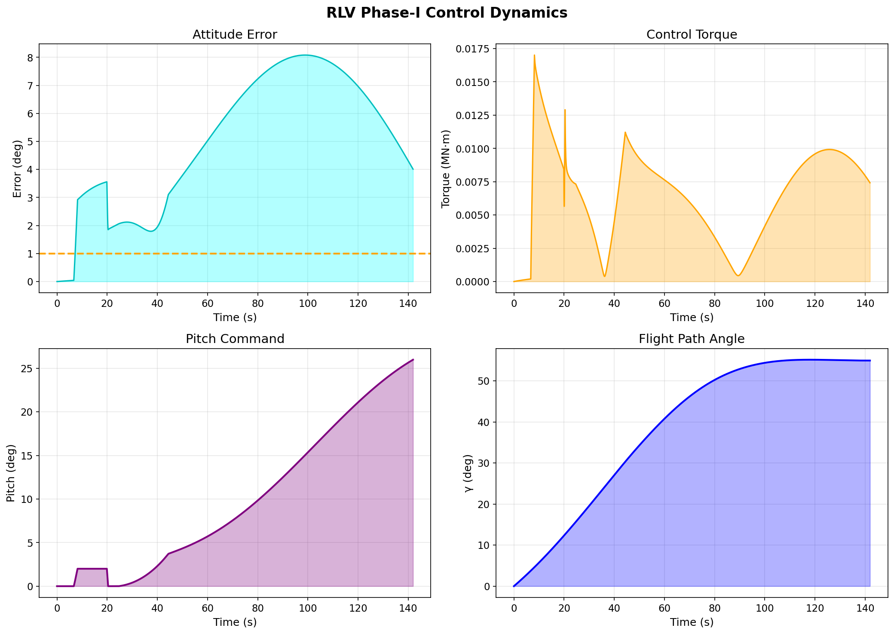
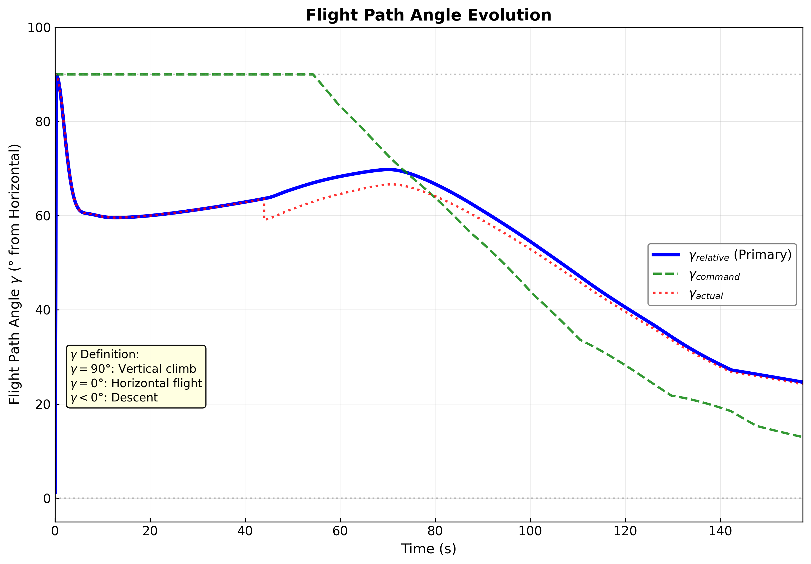

# RLV Phase-I Ascent Simulation



[](https://www.python.org/)
[](docs/RLV_Developer_3.txt)
[](https://github.com/HemanthBear99/Rocket)

> **"Code aimed at the stars."**

This project is a dedicated **6-Degree-of-Freedom (6-DOF) simulation** I developed to support RLV mission verification. It serves as a high-fidelity engineering tool to validate ascent guidance and control logic against rigorous physics models.

*Note: This codebase is a personal development initiative to assist with mission analysis, focusing on pure technical accuracy and deterministic physics.*

---
## 🛠️ Engineering Implementation

This isn't just a script; it's a physics engine. I built it from the ground up to handle the non-linear dynamics of launch vehicles:

### 1. True 6-DOF Rigid Body Dynamics
*   **Translational:** Solves Newton's Second Law ($F=ma$) with variable mass, integrating forces from **Gravity**, **Thrust**, and **Aerodynamic Drag**.
*   **Rotational:** Solves Euler's Equations ($\dot{\omega} = I^{-1}(\tau - \omega \times I\omega)$) for precise attitude tracking.

### 2. High-Precision Math
*   **Quaternions:** Uses quaternion kinematics exclusively preventing gimbal lock singularities common in Euler-angle based sims.
*   **Integration:** Implements a custom **Runge-Kutta 4 (RK4)** solver with strict normalization steps to ensure numerical stability over integration time.

### 3. Realistic Environmental Modeling
*   **Atmosphere:** Full US Standard Atmosphere 1976 model with altitude-dependent density/pressure lapsing.
*   **Aerodynamics:** Dynamic $C_d$ lookup tables based on Mach number regimes.
*   **Propulsion:** Pressure-compensated thrust ($F = F_{vac} - A_e(P_{amb} - P_{vac})$).

---

## 📂 Code Structure

I organized the codebase for clarity and modularity, making it easy to isolate and debug specific physics modules:

```
d:\rocket\Phase-I
├── rlv_sim/
│   ├── main.py         # Simulation Loop & Entry Point
│   ├── dynamics.py     # Equations of Motion (6-DOF)
│   ├── forces.py       # Physics Models (Gravity, Drag, Thrust)
│   ├── guidance.py     # Ascent Guidance Algorithms
│   ├── control.py      # Attitude Control Logic
│   └── integrators.py  # Numerical Solvers
├── scripts/            # Analysis Tools
└── plots/              # Output Data
```

---

## 📊 Ascent Results (Phase I)

The simulation successfully demonstrates a nominal ascent profile from Liftoff to Main Engine Cut-Off (MECO).

### 1. Ascent Profile Dashboard
*Combined view of Altitude, Velocity, Mass, and Pitch.*


### 2. Control System Performance
*Attitude tracking error, Control Torque usage, and Guidance commands.*


### 3. Flight Path Angle Evolution
*Physics verification: γ starts at 90° (Vertical) and decreases during Gravity Turn.*


## 📋 Simulation Metrics

| Parameter | Value (approx) | Description |
| :--- | :--- | :--- |
| **MECO Altitude** | **~110 km** | Target met (>100 km) |
| **MECO Velocity** | **~2,700 m/s** | Hypersonic exit |
| **Downrange** | **~145 km** | Horizontal distance traveled |
| **Attitude Error** | **< 7.5°** | Stable control throughout ascent |

---

## ⚡ Running the Simulation

To replicate these results or test new parameters:

1.  **Install Dependencies:**
    ```bash
    python -m pip install -r requirements.txt
    ```

2.  **Launch:**
    ```bash
    python -m rlv_sim.main
    ```

3.  **Visualize:**
    ```bash
    python scripts/plot_generator.py
    ```
4. **CSV**
```bash
     python -c "from rlv_sim.main import run_simulation; s, log, r = run_simulation(verbose=False); log.to_csv('plots/full_telemetry.csv')"
```

---
*Built with ❤️ for Rocket Science.*